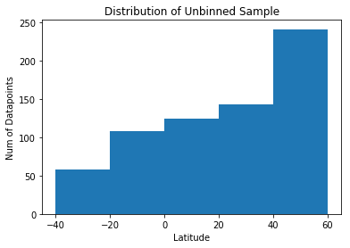

```python
import mycitipy
import json
import requests
import numpy as np
import matplotlib.pyplot as plt
#no need for gitignore yet
from apikeys import OWP_key
import pandas as pd
from time import sleep
```


```python
def OWP_call(city, country, key):
    url = 'http://api.openweathermap.org/data/2.5/weather?q='
    sleep(.1) #slow the calls down a little
    #print(city)
    city_dat = {}
    w_dat = requests.get(url + city + ',' + country + '&units=imperial' + '&apikey=' + key).json()
    # uncomment key for debugging
    print_url = url + city + ',' + country + '&apikey='# + key
    print_url = print_url.replace(" ", "_")
    #print(print_url)
    try:
        #print(w_dat['main']['temp_max'])
        city_dat = {
            'name': city,
            'country': country,
            'temp': w_dat['main']['temp_max'],
            'lat': w_dat['coord']['lat'],
            'lng': w_dat['coord']['lon'],
            'hum': w_dat['main']['humidity'],
            'wind': w_dat['wind']['speed'],
            'clouds': w_dat['clouds']['all'],
            'url': print_url
        }
        #print(city_dat['name'], ' - ', city['lng'], '/', '180' end = '\t')
    except KeyError:
        #try:
        #    print(city, w_dat['message'])
        #except:
        #    print(city, ' other error')
        #    pass
        pass
    return city_dat
```


```python
#looks around cities with no weather data for one that does have data

def lookaround(lat, lng, step, key):
    
    cities_searched = []
    list_01 = [lat-step/4, lat, lat+step/4]
    list_02 = [lng-step/4, lng, lng-step/4]
    city_dict = {}
    

    city = mycitipy.nearest_city( lat, lng)
    
    #check if there is/are cities near search point
    if abs(city.lat - lat) <= step/2 and abs(city.lng - lng) <= step/2:
        city_dict = OWP_call(city.city_name, city.country_code, key)
            
        #if there is data, 
        if len(city_dict) > 4:
            #print('the easy way')
            return city_dict
        
        else: #if not found the easy way, look around point
            cities_searched.append(city)
            for i in list_01:
                for j in list_02:
                    city = mycitipy.nearest_city( i, j)
                    
                    if city not in cities_searched:  #don't need to check for proximity b/c of initial check
                        city_dict = OWP_call(city.city_name, city.country_code, key)
                        #if data was returned, return it in turn
                        if len(city_dict) > 4:
                            #print('the hard way')
                            return city_dict
                        else:
                            cities_searched.append(city)
            return {}
            #print('what a lonely island ', city.city_name, ' is')
    else:
        return {}
```


```python
#demonstration call
#OWP_call('san antonio','us', OWP_key)
```


    {'clouds': 1,
     'country': 'us',
     'hum': 24,
     'lat': 29.42,
     'lng': -98.49,
     'name': 'san antonio',
     'temp': 71.6,
     'url': 'http://api.openweathermap.org/data/2.5/weather?q=san_antonio,us&apikey=',
     'wind': 11.41}


```python
#edited citipy to include self.lat
#mycitipy.nearest_city(50,50).lat
```


    51.1786


```python
#demo call
#lookaround(50,50,5,OWP_key)
```


    {'clouds': 68,
     'country': 'ru',
     'hum': 80,
     'lat': 51.2,
     'lng': 49.73,
     'name': 'ozinki',
     'temp': 35.68,
     'url': 'http://api.openweathermap.org/data/2.5/weather?q=ozinki,ru&apikey=',
     'wind': 10.74}


```python
#retrieves geoloc of cities for weather data retrieval
print('To skip, run csv reader cell two cells below this.')
cities = []
last_city = ''
total_steps = 20000    # 360*180/(latlngstep)
latlngstep = (360*180/ total_steps)**.5
#delta is accuracy filter for nearest _city placement filters out ~20% of false matches
#of extra points near coastline
delta = latlngstep/2
count = 0
for lng in np.linspace(-180.0,180.0,num = round(360/latlngstep)):
    for lat in np.linspace(-90.0,90.0, num = round(180/latlngstep)):
        count += 1
        city_dict = lookaround(lat,lng, latlngstep, OWP_key)
        if len(city_dict) > 4:
            cities.append(city_dict)
            print('#', end = '')    #prints map
            #print(f'{city_dict["name"]}, {city_dict["country"]}  --  {count}/{total_steps} ' )
            #print(city_dict['url'])
        else:
            print(" ", end = '')
            pass
    print()
temps = {}
print()
print(len(cities), ' cities' )
```

                                                                                          #             
                                                                                                        
                                                                                                        
                                          ##                                                            
                                                                                         #              
                                              #                                           #             
                                           #                                                            
                                                                                                        
                                                                                         #              
                                                                                                        
                                                                                       #                
                                          #                       #                                     
                                                                 #                                      
                                                                 #                           #          
                                                                #                                       
                                                                                     #                  
                                         #  #                                         ##                
                                            #                                          #                
                                                                                         #              
                                                                                                        
                                                                                                        
                                                                                                        
                                                                                                        
                                                #                                      #                
                                                                                        #               
                                         #                                           ###   #            
                                                                                           ##           
                                                                                   ##                   
                                                                                   #                    
                                                                                 # ##    #              
                                                                                ## #                    
                                                                           ####### ##                   
                                                                          ##########  #                 
                                                                        ##### ####  #                   
                                                                        ##### #######                   
                                                                      ####   ######## #                 
                                                                     # ###  ## ######  ##               
                                                                     # #### #### ####                   
                                                                   ####### #########                    
                                                                  ##################                    
                                                                   ############# ###                    
                                                                ################ ####                   
                                                                ##### ##############                    
                                                               ####### ####    # ####                   
                                                               ######### ## # ######                    
                                                               ############## ####  #                   
                                                              ####  ##############                      
                                                              ###    #############                      
                                                              ###     ############                      
                                                             ####     ############                      
                                                     #       #####    ######### #                       
                                                            ######    ############                      
                                                           ##### #    ######### ##                      
                                                          #####   #   ######### ##                      
                                                          ###   # ############## #                      
                                                  #####   ##    #################                       
                                                ########  ##   #### #   #########                       
                                              ######  #####    ### ##    #########                      
                                             ##### # ########    ###       ##### #                      
                              #####         #### # #   ######   #           #####                       
                        #   #  ########     ###  #    #######  ##           #####                       
                         #         #  ########## #### # #####   #           ### #               #       
                       #    #   # ###       ######  ##  ####   ##             ####       #  #           
                              #    # #  ########   ##      #    #             ####        #             
                              #  #### # #######  ## ##    ###   #      #      ####                      
                               ## ###     ########## #    ### ###              ##                       
                                #####  # #     ## ###  #  #####                #                        
                                ######## ##  #     ##    #   #                  # #                     
                                 ### ##########   # #    #                     ###            #         
                                  ############  #  ##   ##                     ###                      
                                   ###########       #  ##                      #        ###            
                                    ##########    # #####                                # ##           
                                     ##########  # ###                                  #               
                                      ############# ##                                                  
                                        ########### ##                                 #                
                                         ############                                  #                
                                         ############                                                   
                                          ###########                                                   
                                           ##########                                                   
                                               #####                                      #             
                                                ####                                                    
                                                                                                        
                                                                                                        
                                                                                                        
                                                                           #                            
                                                                          ##                            
                                                              ##                                        
                                                              ##                         #              
                                                                                        ##              
                                                                                          #             
                                                            ###  #   # #                  #             
                                                            ####     #                   #              
                                                 #         ####  #   #                                  
                                                         ######                                         
                                                         #####        ##   # #    ##                    
                                                        ######         ## ####    ###                   
                                             #          #######         ######   ########               
                                                        ###### #  #      #####  ######                  
                                                        ####### #        ##### ########                 
                                                        #######      #    ############ #                
                                                         ###### ##         #########                    
                                                         #####           ##########                     
                                                         ## ###           ## #######  ###               
                                                        #######              ####### ####               
                                                     # ##########        #################              
                                                    ##########           # ###############              
                                             #    ############         #### ###############             
                                         #  ## # ###### #####   #   #  #### ###########   ##            
                                       # ## # # ## ###########        ## ################ ###    #      
                                   # ## ###### ## # # # ######         #   ##############  ##           
                                   ## #### ##      ## ########             ############ #  ##           
                                   #  #        ##### ###### ##        ##  #### ####### ######           
                                   #### # ## ## # ###  ##### #          # ###################           
                                   ######   #### ##   ###    #         # ################## ##          
                                   ############## ###   #    #           ################## ##          
                                   ######## ######  #  #               # #################   #          
                                     ###################    ##         #  ### ########### ###           
                                     #### ### ###########   ##  #  ##### ####  ##############           
                                       ## ## ###########    ###    #     #### ###############           
                                        #  ############# ### #         ################### #            
                                            ##  ######## ###### #  # ######## ##########                
                                             ######### #######         #  ################ #            
                                              # #  ## #  ####    #        ### ############              
                                               #      ###  # ####       ##################              
                                        ###   ##       ##  # ###    #   ###################             
                                        #### #         #           #    ################ #              
                                         ######         #             ###################               
                                           ####           # #       # ####### #   #######               
                                                           #       ## #####  ## # ########              
                                                               #     # # ##  #  # ######## #            
                                          #        #               #####  ##  #   ##### #               
                                          ##                      # ########    ###########             
                                                                  #   # ###  #   ######  #              
                                                                    ## # ## ##   #######  #             
                                                                   ## ### ##      #######               
                                                                   # #  # ##       #########            
                                                                    ### ##### #   # ### # #             
                                                                   #### ## ####   #####   #             
                                                                 #############    # ####                
                                                                 #############  # #### #  #             
                                                     ##### #  ###########   ##   ##### # ##             
                                                            ##############  ##    #### ## #             
                                                          ################ # #    #### ####             
                                                          ##############     ##   ####    ##            
                                                         ##############     # # ##### #       #         
                                                         ##    ########          ######                 
                                                               #######         #######                  
                                                                ######      # ## ######    ##           
                                                                 #####        # ######    ##            
                                                                  ####           #####                  
                                                                  ####           ######                 
                                                            #    #####       #    #### #                
                                                         #     #### ##           ## ##                  
                                                        #     ###### #           ## ####                
                                                      ### ####### #        #        # #                 
                                                     ############## #      #     ####    #              
                                                   ## ####  ####   ###    ##  #   #### #     #          
                                                   ######  ## ########## ##     #### #                  
                                                  ###      ## ##### #### # #   # #####                  
                                                 ## #      #####  # #####  #    ###### #                
                                                 ##  ##     ### ########## #   # ####                   
                                                 ## # ##        ######## ## #   ###  #    #             
                                        #        ## #  #          ###########  # #### # # #             
                                   #  #          #  #   #         ###########    ## #####    #          
                                   ##     #      #   ## ###       ##### #####    ###                    
                                  #       #      #  #  #####       ###########   ##  #  #               
                                                ## ###  ## ###### ######### #    ###    #               
                                   #        #    # # #   #########   ###  ####  ## #     #              
                                                #     #  #####     #        ##########    #             
                                                #     # #####      #        ###### # ##                 
                                                   #  #             #     # #### ###    ##              
                                             ##     #                # ##    #####     ##    #          
                                        #      #     #                 ###   #####     ##  #            
                                                  #                     ##   #######    #  #            
                                   #    #      #    ##   #              ##   ###### #  ##  ##           
                                  #           ##                        ###   #####     #               
                                  ###                                    ##    #     # #                
                                 #        #      #                       #####  # ##        #           
                                ## ##            ####                      ########                     
                                ###              ####                        ##   ##  #  #              
                               #####      ###    ###                         ##            #            
                              ## ###     ###    ### #                         #         #   #           
                                  #### # ##       #                             #      ##               
                                  #### ###      #   #                                 ### #             
                                    #####          #                                   ##  #            
                                                  #                                     #               
                                                 ##                              ##     #               
                                                                                   ###                  
                                                ##                                  # # #               
                                                #                                   #      #            
                                          #                                           #                 
                                         ##                                            #   #            
                            ##           ##  ##                                                         
                            ##             #                                                            
                            ####                                                            #           
                             ###  #                    #                                    #           
                               ####                                                                     
                               ###                                                                      
                                ##                                                       #  #           
                                                                                        #               
    
    2953  cities


```python
df_remain = pd.DataFrame(cities)
df_remain.head()
#write to csv
df_remain.to_csv('weather_data.csv')
len(df_remain)
```


    2953


```python
#read from csv to avoid doing calls again doesnt need to run if cell 2 above was run
df_remain = pd.read_csv('weather_data.csv')

```


```python
#binning to get equal representation across latitudes allows more accurate histograms of weather data
#instead of false high densities because of high volume of cities in NA / EU / N. Asia
bins = [-40 ,-20, 0 ,20, 40, 60]
binned = pd.cut(df_remain['lat'], bins, labels = range(len(bins)-1))
df_remain['lat_bin'] = binned

#min bin volume determines bin sample size if bin volume < 100, yields 500 samples max
#bin with fewest datapoints will not be sampled randomly in next cell... 
#all datapoints will be taken to boost overall sample size

sampler = df_remain.groupby('lat_bin')['temp'].count().min()
if sampler > 150:
    sampler = 150
total_samples = sampler * (len(bins)-1)
print(total_samples, ' total sample population')
```

    750  total sample population


```python

df = pd.DataFrame({})
for i in range(len(bins)-1):
    lat_filter = df_remain['lat_bin'] == i
    #sample of smallest bin not random if bin volume < 100
    sub_df = df_remain[lat_filter].sample(n=sampler)
    df = df.append(sub_df)
print(len(df['name']))
df.head()

```

    750


<div>
<style>
    .dataframe thead tr:only-child th {
        text-align: right;
    }

    .dataframe thead th {
        text-align: left;
    }

    .dataframe tbody tr th {
        vertical-align: top;
    }
</style>
<table border="1" class="dataframe">
  <thead>
    <tr style="text-align: right;">
      <th></th>
      <th>Unnamed: 0</th>
      <th>clouds</th>
      <th>country</th>
      <th>hum</th>
      <th>lat</th>
      <th>lng</th>
      <th>name</th>
      <th>temp</th>
      <th>url</th>
      <th>wind</th>
      <th>lat_bin</th>
    </tr>
  </thead>
  <tbody>
    <tr>
      <th>819</th>
      <td>819</td>
      <td>75</td>
      <td>br</td>
      <td>78</td>
      <td>-26.24</td>
      <td>-48.64</td>
      <td>sao francisco do sul</td>
      <td>75.20</td>
      <td>http://api.openweathermap.org/data/2.5/weather...</td>
      <td>5.82</td>
      <td>0</td>
    </tr>
    <tr>
      <th>1</th>
      <td>1</td>
      <td>40</td>
      <td>to</td>
      <td>83</td>
      <td>-21.20</td>
      <td>-175.20</td>
      <td>vaini</td>
      <td>82.40</td>
      <td>http://api.openweathermap.org/data/2.5/weather...</td>
      <td>3.80</td>
      <td>0</td>
    </tr>
    <tr>
      <th>1381</th>
      <td>1381</td>
      <td>88</td>
      <td>za</td>
      <td>15</td>
      <td>-30.97</td>
      <td>22.13</td>
      <td>carnarvon</td>
      <td>75.06</td>
      <td>http://api.openweathermap.org/data/2.5/weather...</td>
      <td>23.82</td>
      <td>0</td>
    </tr>
    <tr>
      <th>2868</th>
      <td>2868</td>
      <td>20</td>
      <td>au</td>
      <td>75</td>
      <td>-26.58</td>
      <td>148.78</td>
      <td>roma</td>
      <td>61.38</td>
      <td>http://api.openweathermap.org/data/2.5/weather...</td>
      <td>7.34</td>
      <td>0</td>
    </tr>
    <tr>
      <th>2890</th>
      <td>2890</td>
      <td>40</td>
      <td>au</td>
      <td>68</td>
      <td>-27.98</td>
      <td>153.33</td>
      <td>nerang</td>
      <td>69.80</td>
      <td>http://api.openweathermap.org/data/2.5/weather...</td>
      <td>11.41</td>
      <td>0</td>
    </tr>
  </tbody>
</table>
</div>


```python
df_remain.plot('lng','lat', kind = 'scatter',s = 1, figsize=(10, 6))
plt.title('Datapoint Spread Trimmed ' )
plt.show()

df.plot('lng','lat', kind = 'scatter',s = 1, figsize=(10, 6))
plt.title('Datapoint Spread Sampled from Trimmed')
plt.show()
```


```python
plt.hist(df_remain['lat'], bins)
plt.title('Distribution of Dataset')
plt.xlabel('Latitude')
plt.ylabel('Num of Datapoints')
plt.show()

plt.hist(df_remain.sample(total_samples)['lat'], bins)
plt.title('Distribution of Unbinned Sample')
plt.xlabel('Latitude')
plt.ylabel('Num of Datapoints')
plt.show()

plt.hist(df['lat'], bins)
plt.title('Distribution of Representative Sample')
plt.xlabel('Latitude')
plt.ylabel('Num of Datapoints')
plt.show()
```





```python
mintemp01 = df_remain['temp'].min()
maxtemp01 = df_remain['temp'].max()
mintemp02 = df['temp'].min()
maxtemp02 = df['temp'].max()

df_remain.plot('lat','temp', kind = 'scatter', s=.5, figsize=(10, 6))
plt.xlabel('Latitude')
plt.ylabel('Max Temperature øK')
plt.title('Max Temp vs Latitude')
plt.vlines(0,mintemp01-5, maxtemp01+5, alpha = .4)
plt.show()

df.plot('lat','temp', kind = 'scatter', s=2, figsize=(10, 6))
plt.xlabel('Latitude')
plt.ylabel('Max Temperature øK')
plt.title('Max Temp vs Latitude; Representative Sample')
plt.vlines(0,mintemp02-5, maxtemp02+5, alpha = .4, label = 'Equator')
plt.show()
```


```python
# Surface plot for temperature
# Thanks to Asela for giving me the formulas
from scipy.interpolate import griddata

sub_df=df_remain[['lng','lat','temp']]
sub_df.columns = ['a', 'b', 'value']
sub_df.head()

X = sub_df.a.values
Y = sub_df.b.values
Z = sub_df.value.values

#Create a target grid for the new interpolated z values
xi = np.arange(X.min(), X.max(), 1)
yi = np.arange(Y.min(), Y.max(), 1)
xi,yi = np.meshgrid(xi, yi)

#Interpolate zi based on X,Y,Z values land them in the xi,yi grid
zi = griddata((X, Y), Z, (xi, yi), method='linear')

#Plot new contour with overlay of original scatter plot
plt.contourf(xi, yi, zi)
plt.colorbar()
ax = plt.gca()
sub_df.plot('a', 'b', kind='scatter', ax=ax,s=10, edgecolor='w',color='white',figsize=(13,8),marker ="s")
plt.title("Surface Max Temperature")
plt.xlabel('longitude')
plt.ylabel('latitude')
plt.hlines(0,X.min(),X.max())
plt.vlines(0,Y.min(),Y.max())
plt.show()
```


```python
df_remain.plot('lat', 'hum', kind = 'scatter', s=.5, figsize=(10, 6))
plt.xlabel('Latitude')
plt.ylabel('% Humidity')
plt.title('Latitude vs Humidity')
plt.show()

df.plot('lat', 'hum', kind = 'scatter', s=2, figsize=(10, 6))
plt.xlabel('Latitude')
plt.ylabel('% Humidity')
plt.title('Latitude vs Humidity: Representative Sample')
plt.show()
```


```python
plt.hexbin(df['lat'], df['hum'], gridsize = 15, bins=None)
plt.xlabel('Latitude')
plt.ylabel('% Humidity')
plt.title('Latitude vs Humidity')
plt.show()
```


```python
df_remain.plot('lat','clouds', kind = 'scatter', s=.5,figsize=(10, 3))
plt.xlabel('Latitude')
plt.ylabel('% Cloud Cover')
plt.title('Latitude vs Cloud Cover; Trimmed Data')
plt.show()

df.plot('lat','clouds', kind = 'scatter', s=.5,figsize=(10, 3))
plt.xlabel('Latitude')
plt.ylabel('% Cloud Cover')
plt.title('Latitude vs Cloud Cover; Representative Sample from Trimmed Data')
plt.show()
```


```python
df_remain.plot('lng', 'lat', kind = 'scatter', s=df_remain['clouds']/2.5+.1 ,figsize=(10, 6))
plt.title('"Clouds" Over Cities')
plt.xlabel('Longitude')
plt.ylabel('Latitude')
plt.show()
```


```python
df_remain.plot('lat', 'wind', kind = 'scatter', s=.25, figsize=(10, 4))
plt.xlabel('Latitude')
plt.ylabel('Windspeed')
plt.title('Latitude vs Windspeed; Data')
plt.show()

df.plot('lat', 'wind', kind = 'scatter', s=2, figsize=(10, 4))
plt.xlabel('Latitude')
plt.ylabel('Windspeed')
plt.title('Latitude vs Windspeed; Sample')
plt.show()
```


```python
plt.hexbin(df['lat'], df['wind'], gridsize = 15, bins=None)
plt.title('Latitude vs Windspeed; Sample')
plt.xlabel('Latitude')
plt.ylabel('Windspeed')
plt.show()
```


```python

```


```python

```
